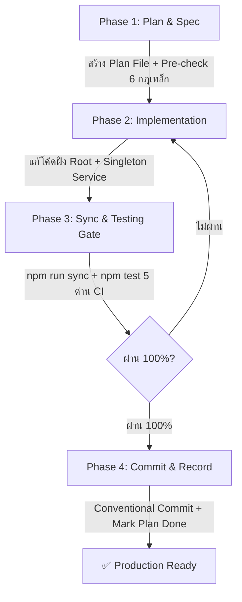

# 🛡️ E-CMIS Activity 7 — Master Development Workflow Standard (`dev-workflow.md`)

> **Project:** E-CMIS Activity 7 — การประชุมคณะกรรมการ ป.ป.ท. และการออกคำสั่ง ม.๒๔ / รายงานวินิจฉัยชี้มูล  
> **Repository:** `PhuriphatTyPeZ3r0/e-cmis-a7-demo`  
> **Standard Version:** 2.0.0  
> **Target Audience:** Developers, Tech Leads, QA, and AI Coding Agents (Antigravity, Claude, Copilot)

---

## 🎯 1. Overview & Core Philosophy

มาตรฐาน **Master Development Workflow** ฉบับนี้ถูกออกแบบขึ้นเพื่อรับประกันคุณภาพ ความถูกต้องของเอกสารราชการ และป้องกันความผิดพลาดระดับ Production สำหรับระบบ **E-CMIS Activity 7**

ทุกงานพัฒนา (Features, Refactoring, Bugfixes, Schema Updates, Template Changes) ที่ไม่ใช่การแก้ไข Trivial (เช่น แก้คำผิดเล็กน้อยในคอมเมนต์) **จะต้องปฏิบัติตามวงจรการพัฒนา 4 ขั้นตอนอย่างเคร่งครัด**



---

## 🔄 2. The 4-Phase Development Lifecycle

### 📋 Phase 1: Planning & Specification (ก่อนเริ่มลงมือเขียนโค้ด)
1. **สร้างไฟล์แผนงาน:** สร้างไฟล์ Markdown ในไดเรกทอรี `docs/memory/plans/` ตามรูปแบบ:
   ```
   docs/memory/plans/<YYYY-MM-DD>-<task-slug>.md
   ```
2. **กรอกข้อมูลใน Plan Template:**
   - วัตถุประสงค์ทางธุรกิจและข้อกฎหมายที่เกี่ยวข้อง (พ.ร.บ. ป.ป.ท. ม.๑๗, ม.๒๔, ม.๗๒)
   - รายชื่อไฟล์และ Route ที่ได้รับผลกระทบ (ทั้งฝั่ง Root และ `/res/`)
   - **6 Golden Anti-Regression Rules Checklist** (Pre-check)
   - แตกรายการงานย่อย (Step-by-Step Task Breakdown)
   - กำหนดเกณฑ์การทดสอบ (Verification Matrix)

---

### 💻 Phase 2: Implementation & Coding Standards
1. **แก้ไขไฟล์ที่ Root Directory เป็นหลัก:**
   - แก้ไขไฟล์ HTML ที่ Root เช่น `inbox.html`, `resolution-72.html`
   - จัดการ CSS/JS กลางใน `assets/ecmis-app.js`, `assets/ecmis-app.css`, `assets/a4-ecmis-workspace.css`
2. **ปฏิบัติตามสถาปัตยกรรมและกฎข้อห้าม (Anti-Regression):**
   - **Supabase Singleton:** ต้องเรียกผ่าน `ECMIS.getSupabaseClient(url, key)` เท่านั้น
   - **Role-Based Access Control (RBAC):** ปฏิบัติตาม `PAGE_PERMISSIONS` ใน `ecmis-app.js` อย่างเคร่งครัด
   - **A4 Document Standards:** คงขนาดระยะขอบ `padding: 15mm 15mm 18mm 20mm` และท้ายกระดาษลับ `bottom: 8mm` สำหรับระบบพิมพ์สารบรรณ

---

### 🧪 Phase 3: Mirror Sync & Testing Gate (การซิงค์และตรวจสอบคุณภาพ)
ก่อนเตรียม Commit ทุกครั้ง ต้องผ่าน Quality Gate ตามลำดับ:

```bash
# 1. ซิงค์ไฟล์ Root ไปยัง /res/ Mirror อัตโนมัติ (แปลง Asset Paths ให้ถูกต้อง)
npm run sync

# 2. รัน Enterprise CI Validator (ตรวจสอบ 5 ด่านแบบเข้มงวด)
npm test
```

#### 🛡️ 5-Layer CI Verification Checklist:
1. **JavaScript Syntax Check (`node -c`):** ไม่มี Syntax Error หรือเครื่องหมาย Merge Conflict ค้าง
2. **Dual-Route Mirroring (Root ↔ `/res/`):** ไฟล์ HTML ฝั่ง Root ทุกไฟล์ต้องมีคู่ใน `/res/` ครบ 100%
3. **Zero-404 Internal Link Audit:** ทุกลิงก์ภายในระบบ (`href="..."`) ต้องมีไฟล์ปลายทางอยู่จริง ไม่พบ 404
4. **Anti-Regression Governance:** คอลัมน์ "ประเภทเรื่อง" ต้องไม่สูญหาย, ประธานไม่มีสิทธิ์เข้า `agenda-registry.html`, ห้ามเรียก Direct Supabase Client
5. **Document Workspace & A4 Layout Integrity:** รักษาระยะขอบ A4 สารบรรณ `15mm 15mm 18mm 20mm` ถูกต้อง

> 💡 **หมายเหตุ:** หากมีการแก้ไขส่วน Persistence / State / Data Model แนะนำให้รัน:
> ```bash
> npm run test:integration
> ```

---

### 📦 Phase 4: Conventional Commit & Record (การบันทึกงาน)
1. **บันทึก Git Commit:** ใช้รูปแบบ Conventional Commits:
   ```bash
   git add .
   git commit -m "<type>(<scope>): <short description>"
   ```
   - `feat(...)`: เพิ่มหน้าจอหรือฟังก์ชันใหม่
   - `fix(...)`: แก้ไขข้อผิดพลาดหรือบั๊ก
   - `docs(...)`: ปรับปรุงเอกสารหรือไฟล์ Plan
   - `refactor(...)`: ปรับโครงสร้างโค้ดโดยไม่เปลี่ยนพฤติกรรมภายนอก
   - `test(...)`: เพิ่มหรือแก้ไขชุดการทดสอบ

2. **Update Plan File:**
   - อัปเดตสถานะใน `docs/memory/plans/<YYYY-MM-DD>-<task-slug>.md` เป็น `Status: Completed`
   - ติ๊กถูก [x] ใน Checklist ทุกข้อ
   - บันทึก Commit Hash หรือผลการทดสอบไว้เป็นหลักฐาน (Audit Trail)

---

## ⛔ 3. The 6 Golden Anti-Regression Rules

ทุกขั้นตอนการทำงานต้องเคารพกฎเหล็ก 6 ข้อนี้อย่างเคร่งครัด:

| ลำดับ | กฎเหล็ก | รายละเอียดและข้อบังคับ |
| :---: | :--- | :--- |
| 1 | **ห้ามลบคอลัมน์ "ประเภทเรื่อง"** | ตารางใน `inbox.html`, `res/inbox.html`, `resolution-inbox.html` ต้องมี 7 คอลัมน์ โดยคอลัมน์ที่ 3 คือ `<th>ประเภทเรื่อง</th>` เสมอ |
| 2 | **ห้ามเปิด `agenda-registry.html` ให้ประธาน/affairs** | ประธาน ป.ป.ท. ตรวจและสั่งการวาระผ่าน `inbox.html` และ `chairman-agenda.html` เท่านั้น |
| 3 | **ห้ามเรียก `supabase.createClient()` โดยตรง** | ต้องเรียกผ่าน Singleton `ECMIS.getSupabaseClient(url, key)` เพื่อป้องกัน Memory Leak และ Multiple GoTrueClient Instances |
| 4 | **ห้ามแก้ไขเฉพาะ Root หรือเฉพาะ `/res/`** | ต้องแก้ไขที่ Root แล้วรัน `npm run sync` เพื่ออัปเดต `/res/` ให้ตรงกัน 100% เสมอ |
| 5 | **ห้ามแก้ไขระยะขอบ A4 สารบรรณ** | ระยะขอบต้องเป็น `padding: 15mm 15mm 18mm 20mm` และท้ายกระดาษลับ `bottom: 8mm` เสมอ |
| 6 | **ห้าม Bypass Pre-commit Hook (`--no-verify`)** | ทุก Commit ต้องผ่าน 5-Layer CI Checks โดยสมบูรณ์ |

---

## 📑 4. Plan Template Specification

ไฟล์แผนงานใน `docs/memory/plans/` ต้องใช้โครงสร้างมาตรฐานดังนี้:

```markdown
# 📋 Task Plan: [Task Title / Feature Name]

> **Plan ID:** `YYYY-MM-DD-[slug]`  
> **Date:** YYYY-MM-DD  
> **Author / Agent:** [Name / Antigravity / Claude]  
> **Status:** [Draft | In Progress | Verified | Completed]  
> **Branch / PR:** `main`

---

## 🎯 1. Problem Statement & Business Objective
- **ปัญหา / ความต้องการ:** อธิบายปัญหาหรือฟังก์ชันที่ต้องการพัฒนา
- **ข้อกฎหมาย / มติที่เกี่ยวข้อง:** เช่น พ.ร.บ. ป.ป.ท. มาตรา ๑๗, ๑๘, ๒๔, ๗๒ หรือแบบฟอร์มมติ 6 ประเภท

---

## 📂 2. Affected Routes & Modules
- [ ] Root HTML: `e-cmis-a7-demo/[filename].html`
- [ ] Mirror HTML: `e-cmis-a7-demo/res/[filename].html`
- [ ] Assets JS/CSS: `assets/...`
- [ ] Scripts / CI: `scripts/...`

---

## 🛡️ 3. The 6 Golden Anti-Regression Pre-Check
- [ ] 1. ไม่กระทบคอลัมน์ "ประเภทเรื่อง" ในตารางหลัก
- [ ] 2. ไม่เปิดสิทธิ์ `agenda-registry.html` ให้ Chairman / Affairs
- [ ] 3. เรียก Supabase ผ่าน `ECMIS.getSupabaseClient()` เท่านั้น
- [ ] 4. มีการวางแผนรัน `npm run sync` หลังแก้ไข Root
- [ ] 5. ควบคุมระยะขอบ A4 สารบรรณ `15mm 15mm 18mm 20mm`
- [ ] 6. ไม่ใช้ `--no-verify` ในการ Commit

---

## 📝 4. Step-by-Step Implementation Tasks
- [ ] **Task 1:** [รายละเอียดขั้นตอนที่ 1]
- [ ] **Task 2:** [รายละเอียดขั้นตอนที่ 2]
- [ ] **Task 3:** [รายละเอียดขั้นตอนที่ 3]

---

## 🧪 5. Verification & Quality Gate Matrix
- [ ] **Manual UI Walkthrough:** ตรวจสอบการแสดงผลและพฤติกรรมบนเบราว์เซอร์
- [ ] **Dual-Route Sync:** รัน `npm run sync` เรียบร้อย
- [ ] **Enterprise CI (5-Layer):** รัน `npm test` ผ่าน 100% (0 errors, 0 warnings)
- [ ] **Integration Test (ถ้ามี):** รัน `npm run test:integration` ผ่าน

---

## 🏁 6. Completion & Sign-off
- **Completed Date:** YYYY-MM-DD
- **Commit Reference:** `commit-hash` หรือ commit message
- **Notes / Retrospective:** บันทึกข้อสังเกตเพิ่มเติม (ถ้ามี)
```
