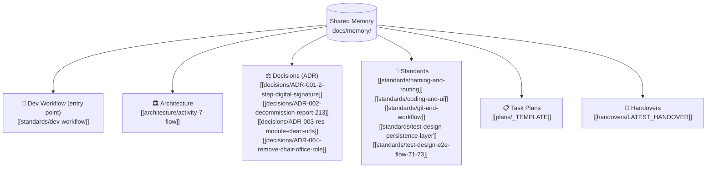

# 🧠 E-CMIS Activity 7 — Shared Memory Vault

> **Obsidian Knowledge Base & Shared Memory** สำหรับ **Claude Code** และ **Antigravity (Gemini)**  
> โฟลเดอร์นี้ออกแบบมาเพื่อให้ AI ทุกตัวและทีมพัฒนาสามารถอ่าน-เขียนความจำและข้อตกลงร่วมกันผ่าน Obsidian ได้แบบ Real-time

---

## 🗺️ Map of Content (สารบัญความรู้)

---

## 📂 หมวดหมู่เอกสาร

### 0. 🧭 Dev Workflow (เริ่มอ่านที่นี่ก่อนเสมอ)
- [[standards/dev-workflow|Master Workflow: Plan → Implement → Test → Commit — ใช้ร่วมกันทั้งคนในทีมและ AI]]

### 1. 🏛️ Architecture & Business Rules
- [[architecture/activity-7-flow|โครงสร้างกระบวนงาน กิจกรรมที่ 7 (มาตรา 24, 7.1, 7.2, 7.3)]]
- กฎหมาย ป.ป.ท. พ.ศ. 2551 และแก้ไขเพิ่มเติม (ม.12 องค์ประชุม, ม.15 มติเสียงข้างมาก, ม.24 คำสั่งไต่สวน)

### 2. ⚖️ Architecture Decision Records (ADR)
- [[decisions/ADR-001-2-step-digital-signature|ADR-001: มาตรฐาน 2-Step Digital Signature ทุก Role]]
- [[decisions/ADR-002-decommission-report-213|ADR-002: การตัด 03-report-213 ออกจากขอบเขตกิจกรรมที่ 7]]
- [[decisions/ADR-003-res-module-clean-urls|ADR-003: การจัดโครงสร้างโมดูล res/ และ Clean URLs]]
- [[decisions/ADR-004-remove-chair-office-role|ADR-004: ตัด role chair_office (หน้าห้องประธานฯ) ออกทั้งระบบ]]

### 3. 📐 Development, Git & Testing Standards
- [[standards/naming-and-routing|พจนานุกรมชื่อไฟล์ และ Routing Map (Clean Semantic URLs)]]
- [[standards/coding-and-ui|มาตรฐานการเขียนโค้ด, CSS/A4 Workspace, Dark/Contrast Mode]]
- [[standards/git-and-workflow|Git Commit Convention และ Dual-AI Handover Directive]]
- [[standards/test-design-persistence-layer|ตัวอย่าง Test Design: Supabase Persistence Layer (State Transition/Equivalence Partitioning/Decision Table/Boundary Value)]]
- [[standards/test-design-e2e-flow-71-73|ตัวอย่าง Test Design: Playwright E2E Flow 7.1/7.2/7.3]]

### 4. 📋 Task Plans
- [[plans/_TEMPLATE|Template สำหรับไฟล์แผนระดับ task]] — แผนจริงแต่ละ task อยู่ใน `docs/memory/plans/<YYYY-MM-DD>-<slug>.md`

### 5. 🤝 AI Session Handovers
- [[handovers/LATEST_HANDOVER|สรุปสถานะล่าสุดและการส่งต่องานระหว่าง AI (Latest Session Sync)]]

---

## 🤖 คำแนะนำสำหรับ AI Agents (Claude & Gemini)
1. **เมื่อเริ่ม Session:** ให้อ่านไฟล์ [[standards/dev-workflow]], [[handovers/LATEST_HANDOVER]] และ [[standards/naming-and-routing]] เป็นอันดับแรก
2. **ก่อนเริ่มงานที่ไม่ trivial:** เขียนแผนลง `docs/memory/plans/` ตาม [[plans/_TEMPLATE]] ก่อน implement — ดูรายละเอียดที่ [[standards/dev-workflow]]
3. **เมื่อมีการตัดสินใจใหม่ (Decisions):** ให้สร้างไฟล์ ADR ใหม่ใน `decisions/ADR-xxx.md` และลิงก์กลับมาที่ `README.md`
4. **เมื่อเสร็จสิ้น Task สำคัญ:** ให้อัปเดตสถานะล่าสุดลงใน [[handovers/LATEST_HANDOVER]] และเติม `status: done` ในไฟล์แผนของ task นั้นเสมอ