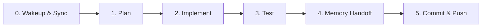

# 🧭 Dev Workflow — Master Memory (Plan → Implement → Test → Commit)

## 🎯 วัตถุประสงค์
เอกสารนี้คือ **entry point เดียว** ของวงจรการพัฒนาเต็มรูปแบบในโปรเจกต์นี้ ใช้ร่วมกันโดย:
- คนในทีม (นักพัฒนา, reviewer)
- **Claude Code** (อ่านตาม `CLAUDE.md`)
- **Antigravity (Gemini)** (อ่านตาม `GEMINI.md`)

ทุกคน/AI ที่ทำงานในโปรเจกต์นี้ **ควรทำวงจรเดียวกัน** ไม่ว่าจะเป็นใคร: วางแผนก่อนเริ่ม → implement ตาม
มาตรฐานที่มีอยู่ → เลือก test layer ให้ตรงกับชนิดงาน → commit ตาม convention

ไฟล์นี้เป็น**ตัวเชื่อม**ระหว่างเอกสารมาตรฐานที่มีอยู่แล้ว ไม่ได้เขียนซ้ำเนื้อหาที่มีอยู่แล้ว:
- Commit convention + AI handover directive เดิม → [[git-and-workflow]]
- มาตรฐานโค้ด/UI → [[coding-and-ui]]
- พจนานุกรมชื่อไฟล์/routing → [[naming-and-routing]]
- ตัวอย่าง test-design จริง → [[test-design-persistence-layer]], [[test-design-e2e-flow-71-73]]

---

## 🔄 วงจร 6 Phase

### 📥 Phase 0 — Wakeup & Sync
ก่อนเริ่มงานใดๆ เสมอ:
1. `git pull origin main`
2. อ่าน `docs/memory/handovers/LATEST_HANDOVER.md` (สถานะล่าสุด)
3. อ่านเอกสารนี้ (`dev-workflow.md`) — ถ้าไม่แน่ใจว่างานประเภทไหนต้องทำ test layer ไหน ให้กลับมาดู Phase 3
4. เช็ค `docs/memory/standards/` ที่เกี่ยวข้องกับงานที่จะทำ (`coding-and-ui.md`, `naming-and-routing.md`)

### 📝 Phase 1 — Plan
**งานที่ไม่ trivial ทุกงานต้องมีไฟล์แผนก่อนเริ่ม implement** — เขียนลง
`docs/memory/plans/<YYYY-MM-DD>-<slug>.md` ตาม [[plans/_TEMPLATE|template]] (มี frontmatter
`status: draft → approved → in-progress → done`)

งาน trivial (แก้ typo, ปรับ CSS เล็กน้อย, แก้บั๊ก 1-2 บรรทัดที่ root cause ชัดเจน) ข้ามขั้นตอนนี้ได้

**วิธีเขียนแผน แยกตามผู้ทำงาน:**
- **Claude Code:** ใช้ `/grill-me` (interactive scope clarification) หรือ Plan mode ปกติ แล้วบันทึกผล
  ลงไฟล์แผนตาม template — ไม่ปล่อยแผนไว้แค่ใน local plan-mode file (`C:\Users\<user>\.claude\plans\`)
  เพราะคนอื่น/AI อื่นมองไม่เห็น
- **Antigravity (Gemini) หรือ AI อื่น:** เขียนแผนตาม template โดยตรง แล้วบันทึกลง
  `docs/memory/plans/` ก่อนเริ่ม implement
- **คนในทีม (ไม่มี AI ช่วย):** เขียนแผนเองตาม template แล้ว**ขอ review จากเพื่อนร่วมทีมก่อนเริ่ม**
  (แทนขั้นตอน `/grill-me`) — เปลี่ยน `status: draft` → `approved` เมื่อได้รับการ review แล้ว

ไฟล์แผน**เก็บไว้ถาวร** ไม่ย้าย/ไม่ลบหลังงานเสร็จ — แค่เติม `status: done` (เป็นประวัติศาสตร์การตัดสินใจ
สืบค้นย้อนหลังได้ เหมือน ADR แต่อยู่ในระดับ task ไม่ใช่ระดับสถาปัตยกรรม)

### 🛠️ Phase 2 — Implement
1. แก้ไข/พัฒนาตามแผนใน Phase 1
2. ทำงานใน `e-cmis-a7-demo/` (root + `/res/` mirror เสมอคู่กัน) — **ห้ามแก้แค่ Root หรือแค่ `/res/`**
   รัน `npm run sync` ทุกครั้งหลังแก้ไฟล์ root
3. Reuse ของเดิมก่อนสร้างใหม่เสมอ — เช็ค `assets/ecmis-app.js`/`assets/ecmis-model.js` ว่ามี
   helper ที่ทำสิ่งที่ต้องการอยู่แล้วหรือไม่ ก่อนเขียนโค้ดใหม่
4. ยึดตาม `coding-and-ui.md`/`naming-and-routing.md` และ 6 กฎเหล็ก anti-regression ใน `CLAUDE.md`

### 🧪 Phase 3 — Test
**เลือก test layer ตามชนิดของการเปลี่ยนแปลง** ไม่ใช่ตาม risk-tier ส่วนตัว และไม่ใช่ "รันทุกอย่างเสมอ":

| ชนิดการเปลี่ยนแปลง | Test layer ที่ต้องทำ | คำสั่ง/pattern |
|---|---|---|
| **ทุกการเปลี่ยนแปลง** (ไม่มีข้อยกเว้น) | Static CI 5-layer check | `npm run check` ต้องผ่าน 5/5 ก่อน commit เสมอ |
| แก้ UI/หน้าจอเดียว, ไม่แตะ data-layer | + Manual browser verification | เปิดหน้าจริงผ่าน local server ทดสอบ golden path + edge case, เช็ค console ไม่มี error |
| แก้/เพิ่มโค้ดที่เขียน-อ่าน Supabase (status, RLS, schema) | + Data-layer integration test | สร้าง/อัปเดต `scripts/test-*-integration.js` ตาม pattern `scripts/test-persistence-integration.js` — ยิง REST ตรง ไม่เปิด browser |
| แก้ flow ข้ามหลายหน้า / multi-step user journey (redirect, role switch) | + E2E test | สร้าง/อัปเดต `tests-e2e/*.spec.js` (Playwright) ตาม pattern ที่มีอยู่ — ต้องมี local static server รันที่ `127.0.0.1:8080` ก่อนเสมอ (`npm run test:e2e`) |
| feature ที่มี **state machine หรือ business rule ซับซ้อน** (status code ใหม่, resolution branching ใหม่, กฎ RBAC ใหม่) | + Test-design doc แบบเป็นทางการ | เขียน `docs/memory/standards/test-design-<feature>.md` ระบุ technique ที่ใช้ (State Transition / Equivalence Partitioning / Decision Table / Boundary Value) — ดูตัวอย่างจริงที่ [[test-design-persistence-layer]] และ [[test-design-e2e-flow-71-73]] |

**งาน UI-only หรือ bug fix เล็กไม่ต้องเขียน test-design doc** — บังคับเฉพาะ feature ที่ซับซ้อนจริงตามแถว
สุดท้ายของตาราง

**กฎ "verify ก่อน claim":** ห้ามบอกว่า "ทดสอบแล้ว"/"ผ่านแล้ว" โดยไม่ได้รันจริง — `npm run check` ตรวจแค่
syntax ของ `assets/*.js` เท่านั้น **ไม่ตรวจ inline `<script>` ใน HTML** ดังนั้นถ้าแก้ inline script
ต้อง `node --check` แยกเอง (ดูตัวอย่างวิธี extract ใน `test-design-e2e-flow-71-73.md`) ก่อนเชื่อว่า
syntax ถูก

### 🤝 Phase 4 — Memory Handoff
1. อัปเดต `docs/memory/handovers/LATEST_HANDOVER.md` เสมอ: สรุปงานที่ทำเสร็จ, ไฟล์ที่กระทบ, ปัญหาตกค้าง/
   next steps
2. เติม `status: done` ในไฟล์แผน (`docs/memory/plans/<...>.md`) ของ task นี้
3. ถ้ามีการตัดสินใจสถาปัตยกรรมใหม่ (ไม่ใช่แค่ task-level) → สร้าง ADR ใหม่ใน `docs/memory/decisions/`

### 🚀 Phase 5 — Commit & Push
ดูรายละเอียดเต็มที่ [[git-and-workflow]] — สรุปสั้น:
1. Stage เฉพาะไฟล์ที่ตั้งใจแก้ (ห้าม `git add -A`/`git add .` แบบไม่ตรวจสอบ)
2. Commit message ตาม Conventional Commits (`feat`/`fix`/`refactor`/`docs`/`style`/`test`)
3. `git push origin main` — **โปรเจกต์นี้ push ตรงเข้า `main` เสมอ ไม่ใช้ feature branch/PR**
   (ยึด convention เดิมแม้ขยายเป็นหลายคนในทีม — ทำงานคนละส่วนคนละไฟล์ให้ conflict น้อยที่สุด)

---

## ✅ Definition of Done Checklist
ก่อน push จริง ทุกงาน (ที่ไม่ trivial) ต้องเช็คครบ:

- [ ] มีไฟล์แผนใน `docs/memory/plans/` และ approve แล้ว (หรืองาน trivial ที่ข้ามขั้นตอนนี้ได้จริง)
- [ ] Implement ตามแผน, sync root↔`/res/` แล้ว (`npm run sync`)
- [ ] `npm run check` ผ่าน 5/5
- [ ] Test layer ที่ตรงกับชนิดงาน (ตามตาราง Phase 3) รันจริงแล้วผ่านจริง — ไม่ใช่แค่คาดว่าจะผ่าน
- [ ] `LATEST_HANDOVER.md` อัปเดตแล้ว
- [ ] ไฟล์แผน (ถ้ามี) เติม `status: done` แล้ว
- [ ] Commit message ตาม Conventional Commits
