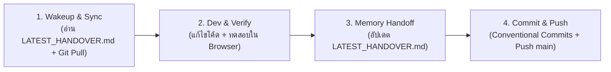

# 🌿 Standard Git & Dual-AI Workflow (Antigravity & Claude Code)

## 🎯 วัตถุประสงค์
กำหนดมาตรฐานการพัฒนา, การจัดการ Git (Commit / Push), และการส่งต่องานผ่าน Shared Memory (Obsidian Vault) ระหว่าง **Antigravity (Gemini)** และ **Claude Code** ให้ทำงานประสานกันได้อย่างไร้รอยต่อ

---

## 🏗️ 1. Architecture & Scope
- **Git Root Directory:** `C:\6_Working\PMO1-03-08-2026\E-CMIS\diagram\Activity 7`
- **Primary Branch:** `main`
- **Shared Memory Vault:** `docs/memory/`
- **Core Application Source:** `e-cmis-a7-demo/`

---

## 🔄 2. The 4-Phase AI Execution Cycle (วงจรการทำงาน 4 ขั้นตอน)

### 📥 Phase 1: Wakeup & Sync (เริ่มต้นงาน)
1. ดึงโค้ดล่าสุด: `git pull origin main`
2. อ่านสถานะโครงการล่าสุดจาก `docs/memory/handovers/LATEST_HANDOVER.md`
3. ตรวจสอบข้อตกลงและมาตรฐานที่เกี่ยวข้องใน `docs/memory/standards/`

### 🛠️ Phase 2: Dev & Self-Verify (พัฒนาและทดสอบ)
1. ดำเนินการแก้ไขหรือพัฒนาฟีเจอร์ใน `e-cmis-a7-demo/res/` หรือ `assets/`
2. ตรวจสอบ Clean Code, DRY, SOLID, และ Error Handling
3. ทดสอบการทำงานจริงผ่าน Local Server (HTTP 200, ไม่เกิด JavaScript Console Error)

### 📝 Phase 3: Memory Handoff (บันทึก Shared Memory)
1. อัปเดตไฟล์ `docs/memory/handovers/LATEST_HANDOVER.md` ทุกครั้ง:
   - สรุปงานที่ทำเสร็จ (Completed Tasks)
   - รายการไฟล์ที่ได้รับผลกระทบ (Impacted Files)
   - ปัญหาตกค้างหรืองานในขั้นตอนถัดไป (Next Steps / Issues)
2. หากมีการตัดสินใจทางสถาปัตยกรรมใหม่ ให้สร้างบันทึกใน `docs/memory/decisions/ADR-xxx.md`

### 🚀 Phase 4: Commit & Push (บันทึก Git และนำส่ง)
1. สเตจไฟล์ที่แก้ไข: `git add .`
2. บันทึก Commit ตามมาตรฐาน **Conventional Commits**:
   - `feat(scope): ...` สำหรับการเพิ่มหน้าจอหรือฟังก์ชันใหม่
   - `fix(scope): ...` สำหรับการแก้ไขบัคหรือข้อผิดพลาด
   - `refactor(scope): ...` สำหรับการปรับโครงสร้างโค้ดหรือ Clean URLs
   - `docs(memory): ...` สำหรับการอัปเดตเอกสารหรือ Memory Handover
   - `style(ui): ...` สำหรับการปรับแก้ CSS / ความสวยงาม UI
3. นำส่งขึ้น Remote: `git push origin main`

---

## 🤝 3. Dual-AI Handover Directives
- **Antigravity (Gemini):** อ่านข้อกำหนดจาก `GEMINI.md`
- **Claude Code:** อ่านข้อกำหนดจาก `CLAUDE.md`
- ทั้งสอง AI ต้องยึดถือ `docs/memory/` เป็น Single Source of Truth เดียวกันเสมอ